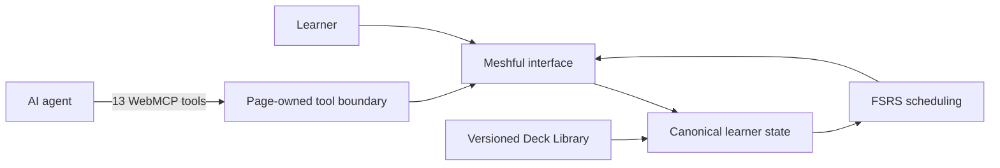

# Architecture overview

Meshful is one chat-led study product with three deliberately separate
responsibilities:

- The **learner** supplies answers and chooses when to study, reveal, continue,
  or move between experiences.
- The **agent** interprets natural-language answers, explains errors, tutors,
  and makes bounded proposals through declared tool schemas.
- The **site** authenticates access, validates tool input and output, owns decks
  and sessions, records mutation receipts, and applies scheduling exactly once.

The agent does not maintain a shadow copy of learner state. WebMCP is an
optional interface over the same page-owned state used by the regular website.

## Main flows

### Study transaction

1. `get_study_session` returns the visible card and a revision-bound grading
   contract.
2. The learner answers in natural language.
3. The agent evaluates meaning against that contract.
4. `submit_grade` validates the revision and idempotency key, records one
   assessment, updates FSRS once, reveals the definition once, and advances once.
5. Exact readback resolves an uncertain network result without duplicating the
   review.

### Deck authoring

Deck changes pass through closed schemas and validation before they reach the
canonical store. The agent can propose or submit declared changes; it cannot
bypass the site's identity, revision, provenance, or content checks.

### Signed-out and signed-in state

Signed-out use stays in a browser-local guest workspace. Signed-in state uses
the trusted account boundary and durable D1 storage. Missing bindings, origin
configuration, or trusted identity fail closed rather than silently falling
back to a different signed-in store.

## Repository map

| Path | Responsibility |
|---|---|
| `site/app/` | Application routes and learner API wrapper |
| `site/public/study/` | Browser interface, deterministic store, WebMCP registration, and public library runtime |
| `site/integration/accounts/` | Trusted identity and account boundary |
| `site/integration/backend/v7/` | Durable learner service and Study writer |
| `site/drizzle/` | Applied D1 schema migrations |
| `site/tests/` | Product, boundary, WebMCP, and deployment-composition tests |
| `release/` | Deployed-source receipt and repository integrity manifest |
| `.github/` | Public collaboration and continuous-integration configuration |

## Evidence boundary

Deterministic checks prove schemas, graph integrity, transaction behavior,
build composition, and source identity. They do not prove that every course is
human-reviewed, that semantic grading is always correct, or that Meshful causes
measured learning outcomes. Those claims require separate evaluation evidence.
